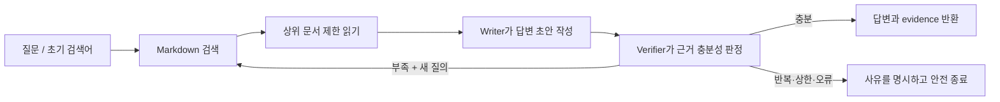

# PiAgent 최소 루프 엔지니어링 구현 보고서

작성일: 2026-08-14  
대상: PiAgent를 직접 확장·검증하는 개발자  
범위: 로컬 Markdown 검색을 이용한 질문 해결 루프와 Bedrock OpenAI 호환 경로

## 결론

PiAgent는 이제 `markdown_search` 호환 MCP 서버가 제공하는 문서를 대상으로 **검색 → 제한된 원문 읽기 → 답변 초안 → 별도 verifier 판정 → 검색어 보정 또는 종료**를 반복할 수 있다. LangGraph가 반복 횟수, 중복 질의, 오류 종료를 소유하므로 모델이 무한히 재시도하는 구조가 아니다.

현재 단계는 “근거를 찾아 질문에 답하는 최소 검증 루프”까지다. 기존 PiAgent의 파일·셸·메모리·스킬 도구 전체를 이 전용 루프가 다시 실행하는 구조나, DOCX/PPTX/PDF를 완성품으로 렌더링하는 파이프라인까지 구현된 것은 아니다.

## 동작 구조



핵심 파일은 다음과 같다.

| 파일 | 책임 |
| --- | --- |
| `piagent/markdown_loop.py` | LangGraph 상태, MCP 어댑터, writer/verifier, 종료 정책 |
| `markdown_loop.py` | 최소 CLI 실행기와 환경 설정 |
| `tests/test_markdown_loop.py` | 반복·실패·MCP·Bedrock HTTP 계약 검증 |

## 구현된 품질 게이트

| 게이트 | 기계적으로 확인하는 조건 | 종료 사유 |
| --- | --- | --- |
| 근거 충분 | verifier가 JSON의 `sufficient=true` 반환 | `sufficient` |
| 반복 상한 | `max_iterations` 도달 | `max_iterations` |
| 진행 정체 | 빈 검색어 또는 이미 실행한 검색어 재제안 | `stalled` |
| 도구 실패 | MCP 검색·읽기 예외 | `error` |
| 모델 출력 실패 | verifier JSON 파싱 또는 타입 검증 실패 | `error` |

Writer와 verifier는 별도 객체와 별도 모델 호출로 구성한다. CLI도 모델 인스턴스를 둘로 초기화한다. 다만 기본 설정에서는 두 역할이 같은 모델 ID를 사용하므로, 공급자·모델까지 완전히 독립된 교차 검증은 아니다.

## 최소 실행 조건

Python 의존성은 기존 `requirements-piagent-minimal.txt`의 9개 직접 핀으로 충분하다. 별도 검색 SDK를 추가하지 않았고 기존 stdio MCP 클라이언트를 재사용한다.

필수 외부 조건은 두 가지다.

1. `search_markdown`, `read_markdown`을 제공하는 stdio MCP 서버의 실행 명령
2. OpenAI API 설정 또는 `LOCAL_BEDROCK_*` 3개 환경변수

구조만 확인하는 명령은 모델과 MCP 서버를 호출하지 않는다.

```powershell
python markdown_loop.py --check
```

실제 실행 예시는 다음과 같다. 저장소에는 `markdown_search` 서버 자체가 포함되어 있지 않으므로 서버 모듈명은 설치 환경에 맞게 바꿔야 한다.

```powershell
python markdown_loop.py "루프 엔지니어링의 핵심과 적용 방법은?" `
  --mcp-command python `
  --mcp-arg=-m `
  --mcp-arg=your_markdown_search_server `
  --root-id workspace `
  --max-iterations 3
```

성공하면 answer, evidence, iteration 수, query history, stop reason을 JSON으로 반환한다. 충분성 판정에 성공하면 종료 코드는 0이고, 상한·정체·오류 종료는 2다.

## Bedrock URL 검증 결과

사용자가 제시한 Tokyo 리전 Bedrock Runtime 기준으로 설정 함수가 다음 요청 경로를 구성하는 것을 테스트했다.

```text
https://bedrock-runtime.ap-northeast-1.amazonaws.com/openai/v1/chat/completions
```

테스트는 가짜 API 키와 `httpx.MockTransport`를 사용해 네트워크·비용 없이 다음을 검증한다.

- Runtime 루트 뒤에 `/openai/v1`이 정확히 한 번 추가된다.
- OpenAI 클라이언트가 `/chat/completions`로 POST한다.
- Bearer 인증 헤더가 구성된다.
- 지정 모델 ID가 요청에 전달된다.

실제 키를 이용한 유료 Bedrock 호출은 수행하지 않았다. 따라서 AWS 측 키 권한, 계정별 모델 액세스, 실제 응답 지연과 비용은 아직 운영 검증 항목으로 남아 있다. 대화에 노출된 키는 재발급하는 것이 안전하다.

## 실제 `markdown_search` 대조

현재 연결된 읽기 전용 `markdown_search` MCP에서 `loop engineering`을 검색하고 결과 문서를 읽어 어댑터 계약을 대조했다.

- 검색 결과: `results[].root_id`, `results[].relative_path`, `title`
- 읽기 결과: `root_id`, `relative_path`, `start_line`, `end_line`, `content`
- 확인 문서: *LangChain: The Art of Loop Engineering*
- 원문 출처: <https://www.langchain.com/blog/the-art-of-loop-engineering>

실제 응답 필드는 구현한 `McpMarkdownSearchBackend`가 처리하는 필드와 일치한다.

## 테스트 결과

전용 테스트는 다음 7개 시나리오를 고정한다.

1. 1회 검색 후 verifier 승인
2. 부족한 근거에 대해 새 검색어로 보정
3. 계속 실패해도 최대 반복에서 종료
4. 같은 검색어 재제안 시 정체 종료
5. verifier가 비정상 JSON을 내면 fail-closed
6. MCP 검색·읽기 인자와 응답 정규화
7. Bedrock OpenAI 호환 HTTP 경로와 인증 헤더

검증 명령:

```powershell
python -m pytest tests/test_markdown_loop.py -q
```

현재 결과: `7 passed`.

## 질문 해결 및 산출물 능력

| 사용자 요청 | 현재 수준 | 경계 |
| --- | --- | --- |
| 로컬 문서를 찾아 질문에 답하기 | 가능, 이번 루프로 명시적 검증 추가 | MCP 서버 설치·명령 필요 |
| 근거가 부족하면 다시 검색하기 | 가능 | 최대 반복 안에서만 수행 |
| Markdown 보고서 작성·저장 | 기존 범용 PiAgent의 `write` 도구로 가능 | 전용 루프는 답변 JSON만 출력 |
| 코드 읽기·수정·테스트 | 기존 범용 PiAgent 도구로 가능 | 권한·워크스페이스 정책 적용 |
| 표나 Mermaid 구조 제안 | 텍스트 산출 가능 | 렌더 결과의 시각 QA는 별도 |
| 데이터 차트 이미지 생성 | Python/사용자 도구를 조합하면 가능 | 전용 차트 파이프라인 미구현 |
| DOCX/PPTX/PDF 완성 파일 | 아직 기본 기능 아님 | 전용 도구 또는 MCP가 필요 |
| 웹 최신 정보까지 자동 조사 | 범용 `web_search`는 있음 | 이번 루프는 로컬 Markdown 전용 |

따라서 현재 PiAgent는 **개발 작업과 Markdown 기반 조사·보고서 초안을 처리하는 학습용 에이전트** 수준이다. “무슨 형식이든 자동으로 완성하고 시각 검수까지 끝내는 범용 산출물 에이전트” 수준은 아니다.

## 보안과 남은 위험

외부 API, MCP, LLM 출력이 연결되므로 다음 경계를 적용했다.

- Bedrock endpoint는 HTTPS Amazon Bedrock Runtime 호스트만 허용한다.
- API 키를 코드·테스트 fixture·출력에 저장하지 않는다.
- 검색 루프는 `search_markdown`과 `read_markdown`만 호출한다.
- 문서 읽기 줄 수, 검색 개수, 전체 반복 횟수를 제한한다.
- verifier 출력은 JSON 타입까지 검증하고 실패 시 중단한다.
- 같은 질의를 다시 실행하지 않는다.

아직 남은 위험은 다음과 같다.

- 설치한 MCP subprocess 자체의 공급망 신뢰는 사용자가 관리해야 한다.
- 검색 문서 안의 prompt injection을 별도 분류·격리하지 않는다.
- 생성 답변의 개별 문장과 evidence 사이 자동 인용 검증은 없다.
- 토큰·금액 예산은 반복 횟수로만 간접 제한한다.
- 같은 모델 ID를 writer/verifier에 쓰면 판단 오류가 상관될 수 있다.

## 다음 우선순위

가장 작은 다음 thin slice는 답변의 주장마다 `relative_path` 근거를 연결하는 structured citation 검증이다. 그다음에만 기존 범용 도구 실행 루프와 연결하고, 문서·차트·슬라이드별 렌더러를 각각 독립된 품질 게이트로 추가하는 편이 현재 프로젝트의 학습 목표와 안전 범위에 맞는다.
